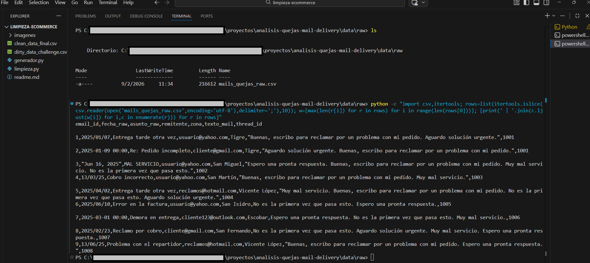
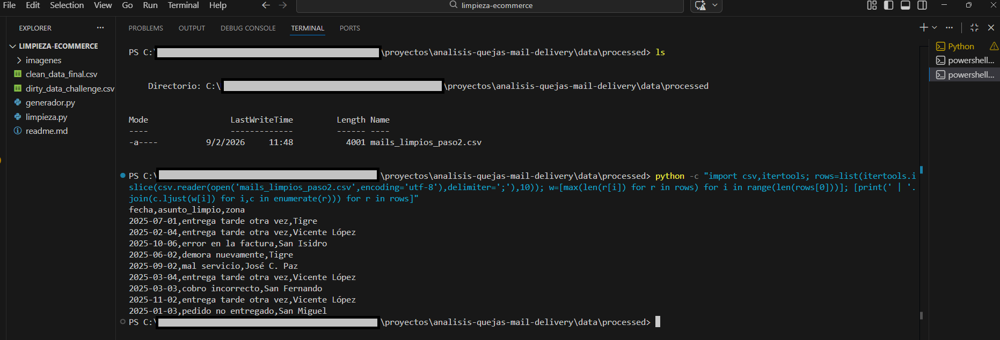
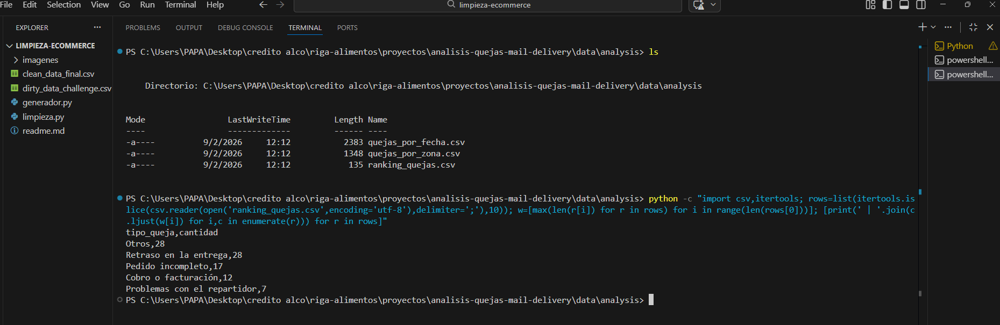
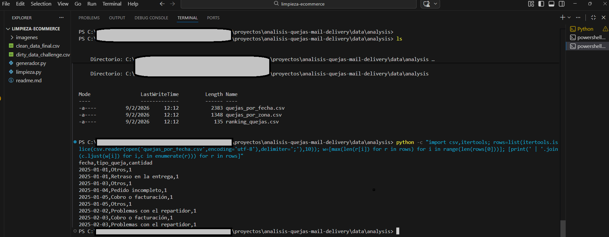
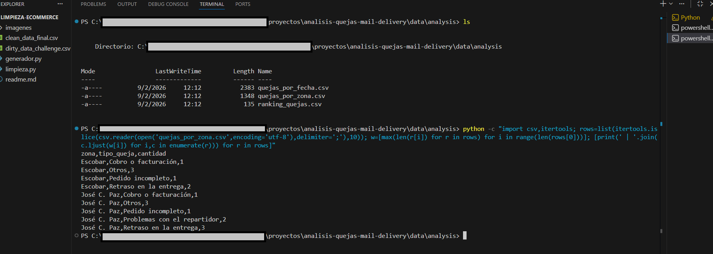

# 📬 Análisis de Quejas por Email – Empresa de Entregas a Domicilio

Este proyecto simula el análisis de una **casilla de emails de quejas** de una empresa de entregas a domicilio, transformando mensajes no estructurados en **información accionable para la toma de decisiones operativas**.

El dataset corresponde a **6 meses de reclamos (enero–junio 2025)** en la **zona Norte del AMBA**.

---

## 📌 Escenario

La empresa recibe cientos de correos diarios con reclamos de clientes.  
La información llega en formato **no estructurado**, lo que dificulta responder preguntas clave como:

- ¿Cuáles son las quejas más frecuentes?
- ¿En qué períodos aumentan?
- ¿Qué zonas presentan más problemas?
- ¿Qué tipo de reclamo requiere prioridad operativa?

El objetivo fue **convertir emails en datos analizables**.

---

## 🧹 Problemas del Dataset Original

El dataset inicial simuló una casilla real de emails con:

- Fechas en múltiples formatos
- Asuntos escritos de forma inconsistente
- Texto libre sin clasificación
- Información irrelevante para el análisis
- Falta de una nomenclatura oficial de reclamos

---
## 📊 Tecnologías Utilizadas

- **Python 3.x**  
  Lenguaje principal para el procesamiento y análisis de datos.

- **Pandas**  
  Limpieza, transformación y agrupación de datos estructurados y no estructurados.

- **Expresiones Regulares (Regex)**  
  Normalización y limpieza de texto libre proveniente de asuntos de emails.

- **CSV / File Handling**  
  Manejo de datasets en múltiples etapas del proceso (raw, processed, analysis).

- **Rule-Based Text Classification**  
  Clasificación de reclamos mediante reglas de negocio sin uso de modelos de ML.

- **Análisis Temporal de Datos**  
  Agrupación y análisis de reclamos por fecha y período.

- **Git & GitHub**  
  Control de versiones y publicación del proyecto como portfolio profesional.

---

## 📁 Estructura del Proyecto

- mails_quejas_raw.csv → emails sin procesar 
- limpieza_mails_paso2.py → limpieza y extracción de datos
- mails_limpios_paso2.csv → fecha, asunto y zona depurados
- clasificacion_quejas_paso3.py → clasificación y análisis de reclamos

- resultados del análisis
  - ranking_quejas.csv → ranking general de reclamos  
  - quejas_por_fecha.csv → evolución temporal de quejas  
  - quejas_por_zona.csv → distribución geográfica  
 
---

## 🛠️ Proceso de Limpieza y Transformación

### 1️⃣ Extracción de información clave
Desde cada email se extrajeron únicamente los campos relevantes:
- Fecha del reclamo
- Asunto del mail
- Zona geográfica

### 2️⃣ Limpieza y normalización
- Conversión de fechas a un formato estándar
- Limpieza de texto (minúsculas, eliminación de prefijos y símbolos)
- Eliminación de registros inválidos

### 3️⃣ Clasificación de quejas
Se definió una **taxonomía de 5 tipos de reclamos**, asignando cada mail mediante reglas de negocio:

1. Retraso en la entrega  
2. Pedido incompleto  
3. Producto en mal estado  
4. Problemas con el repartidor  
5. Cobro o facturación  

---

## 🧠 Script principal

### `limpieza_mails_paso2.py`
Contiene la lógica de:
- Parsing de fechas con múltiples formatos
- Limpieza de texto no estructurado
- Selección de variables clave para el análisis

### `clasificacion_quejas_paso3.py`
Implementa:
- Clasificación rule-based de reclamos
- Agrupación por fecha, tipo de queja y zona
- Generación de datasets analíticos

Los scripts fueron diseñados para ser **claros, reproducibles y reutilizables** en escenarios similares.

---

## 📊 Resultados del Análisis

Se generaron archivos listos para visualización y reporting:

- `ranking_quejas.csv`  
  → Ranking general de reclamos más frecuentes

- `quejas_por_fecha.csv`  
  → Evolución temporal de los tipos de quejas

- `quejas_por_zona.csv`  
  → Distribución de reclamos por zona geográfica

Estos outputs permiten construir dashboards en **Power BI o Tableau** para seguimiento operativo.

---

## 🚀 Cómo ejecutar el proyecto

1. Clonar el repositorio   
   ```bash
   git clone https://github.com/marhermac/mariomaciel.git
2. Instalar dependencias:
   ```bash
   pip install pandas

3. Ejecutar los script en orden: 
   ```bash
    python scripts/limpieza_mails_paso2.py

    python scripts/clasificacion_quejas_paso3.py

 📊 Resultado del proceso de limpieza

 Dataset original (mail_quejas_raw)
<p align="center">  </p>
Dataset limpieza2 (datos limpios)
<p align="center">  </p>
Ouput ranking_quejas (datos limpios)
<p align="center">  </p>
   
Ouput quejas_por_fecha (datos limpios)
<p align="center">  </p>
   
Ouput quejas_por_zona (datos limpios)
<p align="center">  </p>
   

👤 Autor

Mario Maciel
Data Analyst Jr
📍 Argentina
🔗 LinkedIn: https://www.linkedin.com/in/marmaciel
